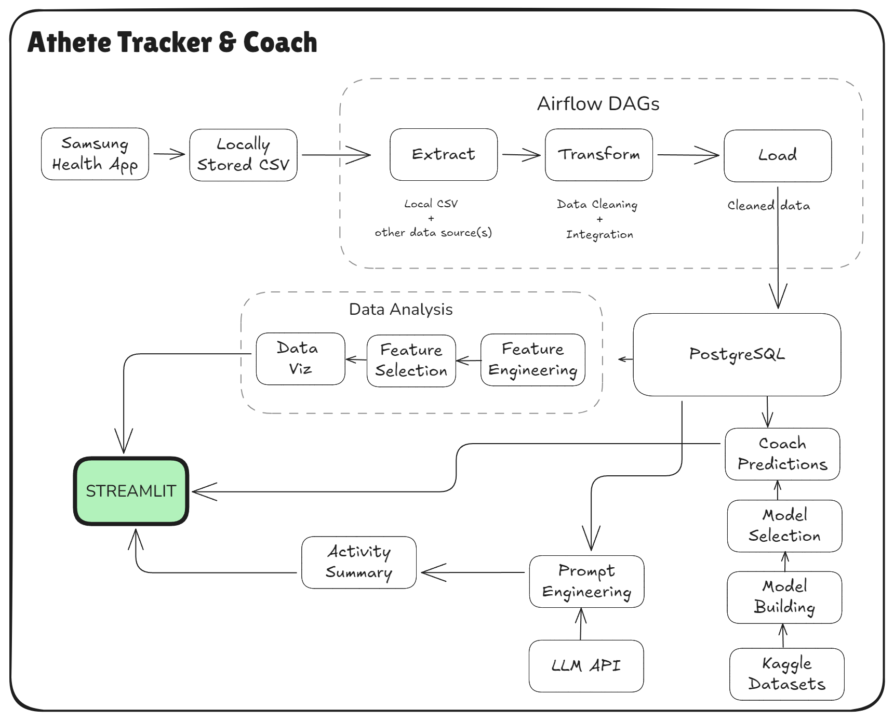

# 🏃‍♂️ AthleteX : Athlete Tracker & Coach
[](https://github.com/MShawon/github-clone-count-badge)

A comprehensive fitness analytics platform that aggregates health data from multiple sources, processes it with machine learning, and delivers personalized insights through an interactive web dashboard and AI coaching assistant.

<picture>
  <source media="(prefers-color-scheme: dark)" srcset="img/LifeCycle_dark.png">
  <source media="(prefers-color-scheme: light)" srcset="img/LifeCycle_light.png">
  
</picture>


## 🌟 Overview

Athlete Tracker & Coach is a full-stack fitness analytics platform that:
- **Collects** health data from smart bands, watches, and fitness apps
- **Processes** and stores data in PostgreSQL and cloud storage
- **Analyzes** trends using ML models and LLM-powered insights
- **Visualizes** metrics through an interactive Streamlit dashboard
- **Coaches** users with AI-powered fitness recommendations

## 🚀 Features

### 📊 Multi-Source Data Integration
- **Device Support**: Samsung Galaxy Watches, Fit bands & wearables like Smart Ring
- **App Integration**: Samsung Health, and more in future (google fit , strava, garmin) 
- **File Formats**: CSV exports, FIT, GPX, KML, TCX files
- **Real-time Processing**: Airflow DAGs for automated ETL pipelines

### 🎯 Interactive Dashboard
- **Stress Monitoring**: Stress level tracking with min/max ranges
- **Heart Rate Analytics**: Detailed HR trends with confidence intervals
- **SpO2 Tracking**: Oxygen saturation monitoring
- **Step Counting**: Comprehensive step analysis with run/walk breakdown
- **Calorie Burn**: Multi-metric calorie tracking and goal setting

### 🗺️ Activity Visualization
- **Outdoor Activities**: GPS route mapping for walks, runs, and workouts
- **File Support**: FIT, GPX, KML, TCX parsing with coordinate normalization
- **Interactive Maps**: Folium-powered route visualization with start/end markers
- **Performance Charts**: Altair-based vital metrics over time

### 🤖 AI Coaching
- **LLM Integration**: GPT/Claude/LLAMA-powered fitness recommendations
- **Personalized Insights**: Data-driven workout suggestions
- **Goal Tracking**: Progress monitoring and achievement analysis

## 🛠️ Tech Stack

### Backend & Data Processing
- **Python 3.8+** - Core programming language
- **Pandas** - Data manipulation and analysis
- **SQLAlchemy** - Database ORM and connection management
- **Apache Airflow** - ETL pipeline orchestration
- **Supabase** - PostgreSQL database with real-time capabilities

### Frontend & Visualization
- **Streamlit** - Web application framework
- **Altair** - Interactive statistical visualizations
- **Folium** - Interactive map rendering
- **Streamlit Navigation Bar** - Custom navigation component

### Data Storage
- **PostgreSQL** - Primary relational database (via Supabase)
- **S3-compatible Storage** - JSON binning data and file storage
- **Local Cache** - Session-state management for performance

### External Integrations
- **Samsung Health API** - Health data extraction
- **LLM APIs** - AI coaching and insights
- **File Parsing Libraries**: `fitparse`, `gpxpy`, XML parsing

## 📦 Installation

### Prerequisites
- Python 3.8 or higher
- Supabase account and project
- S3-compatible storage (for JSON files)

### Setup Instructions

1. **Clone the repository**
```bash
git clone https://github.com/your-username/athlete-tracker-coach.git
cd athlete-tracker-coach
```

2. **Install dependencies**
```bash
pip install -r requirements.txt
```

3. **Environment Configuration**
Create a `.env` file with your credentials:
```env
# Database Configuration
url=your_supabase_url
key=your_supabase_key
user=your_db_user
password=your_db_password
host=your_db_host
port=5432
dbname=your_db_name

# Storage Configuration
json_bucket=your_json_bucket_name
healthsync_bucket=your_activity_files_bucket
```

4. **Database Setup**
The application will automatically create necessary tables on first run using the defined SQLAlchemy models.

5. **Run the Application**
```bash
streamlit run app.py
```

## 🔧 Configuration

### Data Sources
Configure your data sources in `METRICS_CONFIG` (app.py):
```python
METRICS_CONFIG = {
    "stress": {
        "table": "stress",
        "columns": ["start_time", "score", "min", "max", "time_offset", "binning_data"],
        "jsonPath_template": "com.samsung.shealth.stress/{0}/{1}",
    },
    # ... other metrics
}
```

### Supported File Formats
- **FIT**: Garmin device recordings
- **GPX**: GPS exchange format
- **KML**: Keyhole Markup Language
- **TCX**: Training Center XML

## 📈 Usage

### Dashboard Navigation
1. **Home**: Overview of daily metrics and goal completion
2. **Dashboard**: Detailed health metric visualizations with date filtering
3. **Activity**: Workout routine dashboard and GPS activity tracking with route visualization
4. **Coach**: AI-powered fitness recommendations
5. **More**: Additional settings and features

### Data Filtering
- Use date pickers to focus on specific time periods
- Time selectors for hourly binning data
- Interactive charts with hover tooltips
- Map controls for activity route inspection


## 📄 License

This project is licensed under the GNU General Public License v3.0 - see the [LICENSE](LICENSE) file for details.

## 🙏 Acknowledgments

- Samsung Health for data export capabilities
- Streamlit team for the excellent web framework
- Supabase for backend infrastructure
- Altair and Folium communities for visualization tools

---

**Note**: This application is designed for personal fitness tracking and should not be used for medical diagnosis. Always consult healthcare professionals for medical advice.


